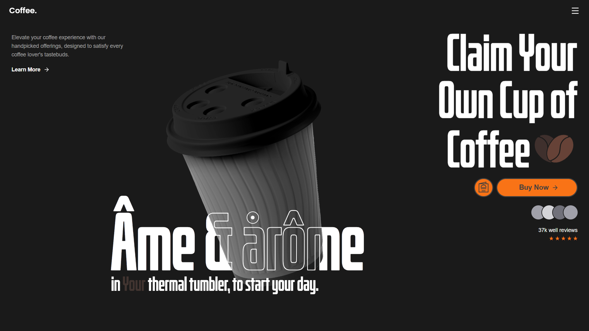
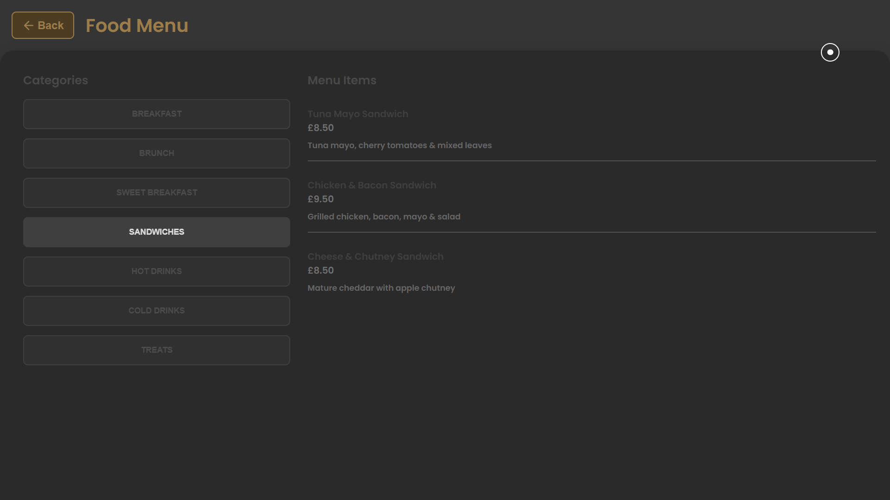

<p align="center">
  
  <br />
</p>

---
# Coffee Shop — Premium Menu-Driven Experience (Next.js App Router)
This repository contains a **from-scratch Next.js App Router application** for a premium coffee shop website.
The project emphasizes **high-fidelity UI**, **explicit loading orchestration**, and a **MongoDB-backed dynamic menu system**, all built without UI frameworks or heavy abstractions.
</br>
> ⚠️ This project was initialized from a **completely blank folder** and manually structured.

</br>

## 🚀 Setup:

### Environment

```env
MONGODB_URI=mongodb://localhost:27017/
```

### Install

```bash
npm install
```

### Seed Menu

```bash
npx tsx scripts/seed-menu.ts
```

### Run

```bash
npm run dev
```

---

## **🏗️ Architectural Overview**

The application is built around four core pillars:

1. **Explicit Loading Control**
2. **Component-isolated UI architecture (CSS Modules)**
3. **Dynamic Menu backed by MongoDB + Route Handlers**
4. **Deep UI composition (Hero, Reviews, Cursor, Layout)**

---

## **🗂️ Project Structure**

```
coffee-shop/
├─ app/
│  ├─ globals.css
│  ├─ layout.tsx
│  ├─ loading.tsx
│  ├─ page.tsx
│  ├─ page.module.css
│  ├─ about/
│  │  ├─ page.tsx
│  │  └─ about.module.css
│  ├─ menu/
│  │  ├─ page.tsx
│  │  └─ menu.module.css
│  └─ api/
│     └─ menu/
│        ├─ categories/route.ts
│        └─ items/route.ts
│
├─ components/
│  ├─ CustomCursor/
│  │  ├─ CustomCursor.tsx
│  │  ├─ CustomCursor.module.css
│  │  └─ index.ts
│  │
│  ├─ Loader/
│  │  ├─ Loader.tsx
│  │  ├─ Loader.module.css
│  │  └─ index.ts
│  │
│  ├─ layout/
│  │  ├─ Header/
│  │  │  ├─ Header.tsx
│  │  │  ├─ Header.module.css
│  │  │  └─ index.ts
│  │  └─ Footer/
│  │     ├─ Footer.tsx
│  │     ├─ Footer.module.css
│  │     └─ index.ts
│  │
│  └─ sections/
│     ├─ Hero/
│     │  ├─ Hero.tsx
│     │  ├─ Hero.module.css
│     │  ├─ index.ts
│     │  └─ components/
│     │     ├─ HeroHeadline.tsx
│     │     ├─ HeroTagline.tsx
│     │     ├─ HeroImage.tsx
│     │     ├─ HeroReviews.tsx
│     │     ├─ HeroCTAButton.tsx
│     │     ├─ FoodMenuButton.tsx
│     │     └─ *.module.css
│     │
│     └─ Reviews/
│        ├─ Reviews.tsx
│        ├─ Reviews.module.css
│        └─ index.ts
│
├─ context/
│  └─ LoaderContext.tsx
│
├─ hooks/
│  ├─ useComponentLoadTracker.ts
│  ├─ useFontLoadTracker.ts
│  └─ useImageLoadTracker.ts
│
├─ lib/
│  └─ mongodb.ts
│
├─ models/
│  └─ MenuItem.ts
│
├─ scripts/
│  ├─ menu.txt
│  └─ seed-menu.ts
│
├─ public/
│  ├─ fonts/bitcrusher-condensed-bd.otf
│  ├─ icons/menu.svg
│  └─ images/
│     ├─ coffee-bean.svg
│     └─ paper-coffee-cup.png
│
├─ eslint.config.mjs
├─ next.config.ts
├─ tsconfig.json
├─ next-env.d.ts
├─ package.json
├─ .env.local.example
└─ .gitignore
```

---

## **⚙️ Core Systems (Deep)**

### ❶&nbsp; Loading & UX Orchestration

**Centralized loading state** is implemented via:

* `context/LoaderContext.tsx`
* `components/Loader/Loader.tsx`

Tracked via custom hooks:

* `useComponentLoadTracker`
* `useFontLoadTracker`
* `useImageLoadTracker`

This enables:

* Controlled entrance animations
* Deferred UI reveal until assets are ready
* Page-level loading via `app/loading.tsx`

---

### ❷&nbsp; Hero System (Deep Composition)

The Hero section is **not monolithic**.

It is composed of:

* `HeroHeadline`
* `HeroTagline`
* `HeroImage`
* `HeroReviews`
* `HeroCTAButton`
* `FoodMenuButton`

Each:

* Lives in its own file
* Has its own CSS Module
* Is assembled by `Hero.tsx`

This allows granular animation, layout tuning, and independent reuse.

---

<p align="center">
  <br />
  
</p>

### ❸&nbsp; Menu System (Dynamic + API):

#### Frontend

* `/menu/page.tsx`
* Styled via `menu.module.css`
* Consumes API-driven menu data

#### Backend (Route Handlers)

* `/api/menu/categories`
* `/api/menu/items`

#### Data Layer

* MongoDB connection: `lib/mongodb.ts`
* Schema: `models/MenuItem.ts`

#### Seeding

* `scripts/menu.txt` → raw structured menu
* `scripts/seed-menu.ts` parses and inserts menu data

</br>

> No ORM is used. The MongoDB driver is accessed directly.

---

### ❹&nbsp; Custom Cursor:

* Implemented in `components/CustomCursor`
* Fully CSS + JS controlled
* Designed for premium tactile UI feel

---

## **🧰 Tech Stack**:

* **Framework**: Next.js (App Router)
* **Language**: TypeScript
* **Styling**: CSS Modules + global CSS
* **Database**: MongoDB
* **State**: React Context API
* **Backend**: Next.js Route Handlers
* **Fonts**: Local + Next.js font loading

---

## **❤️ Donations**

I really appreciate all your support If you wanna help me you can donate me using the following public addresses or QR codes:


### Ethereum (ETH)

<p align="center">
  
  <br />
  <code>0x198edebe5Fa55F53Fb33BB9D258180e643e5F91D</code>
</p>

---

### Bitcoin (BTC)

<p align="center">
  
  <br />
  <code>bc1q76fmee6hhchytc27qhqp7cgjda6d93m676zp0n</code>
</p>

---

### Tether USDT (ERC-20)

<p align="center">
  
  <br />
  <code>0x198edebe5Fa55F53Fb33BB9D258180e643e5F91D</code>
</p>

---